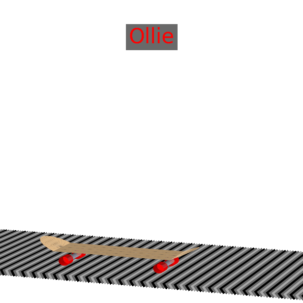
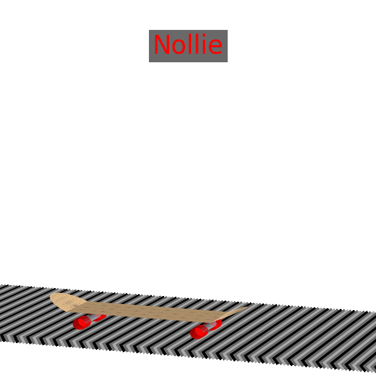
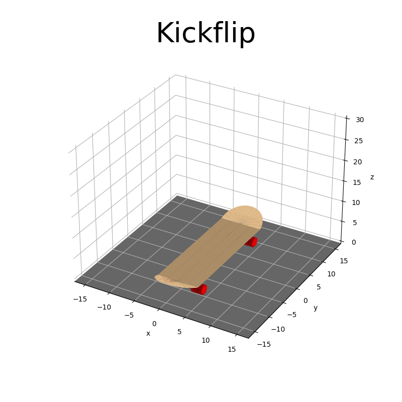
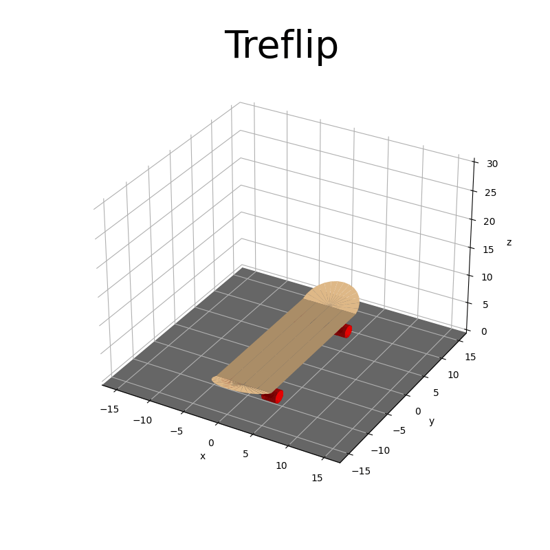
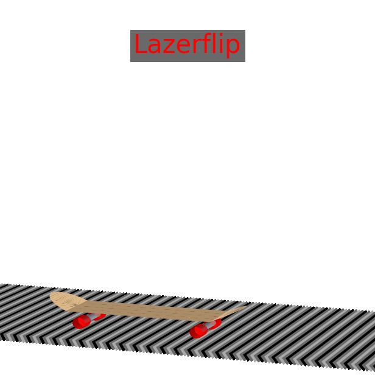

# SKanimATE

Python3 project that focuses on the simulation of skateboard tricks,via cartesian rotation transformations as animated gifs.

### Base Ollie/Nollie Motions

<p float="left">
  
  
</p>

### Tricks with one dimension of rotation

<p float="left">
  
  
</p>

<p float="left">
  
  
</p>

<p float="left">
  
  
</p>

<p float="left">
  
  
</p>

<p float="left">
  
  
</p>

<p float="left">
  
  
</p>

### Tricks with two dimension of rotation

<p float="left">
  
  
</p>

<p float="left">
  
  
</p>

<p float="left">
  
  
</p>

<p float="left">
  
  
</p>

<p float="left">
  
  
</p>

<p float="left">
  
  
</p>

### setup
```bash
git clone https://github.com/Shellywell123/SKanimATE.git
```
```bash
python3 make_gifs.py
```
GIFs will appear in `Images/gifs/`
(Tricks orientations are with respect to Regular stance)

### Features in continuous development

 - skateboard shape
 - ollie motion
 - flip duration to catch time duration
 